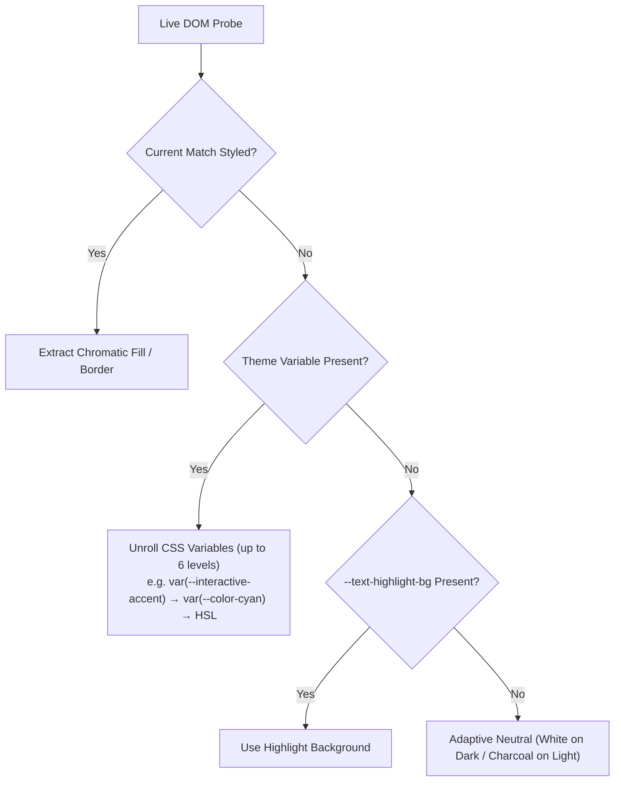

# Obsidian Incremental Search

[](https://github.com/notuntoward/obsidian-incremental-search/actions/workflows/build.yml)
[](https://github.com/notuntoward/obsidian-incremental-search/actions/workflows/codeql.yml)
[](https://github.com/notuntoward/obsidian-incremental-search/actions/workflows/scorecard.yml)

A fast, keyboard-first incremental search plugin for Obsidian.

Designed for users who prefer home-row keyboard navigation—such as users of GNU Emacs (`isearch` / `swiper`) and modal editors. Search results highlight instantly in your active note or PDF as you type, and subsequent keypresses cycle seamlessly through matches without touching the mouse.

---

## Key Features

- **⚡ Instant In-Document Highlighting:** Matches highlight directly in your viewport in real time. The active match features a high-contrast outline, while secondary matches use an adaptive theme-matched fill and inset edge.
- **🎨 Adaptive Theme & Legibility Protection:** Automatically derives secondary match colors from your active theme's background and accent luminance. If background tinting reduces text readability, it automatically falls back to a non-intrusive dotted underline.
- **↔️ Directional Navigation from Cursor:** Search begins from your current cursor position. Forward and backward commands navigate through matches relative to where you are working.
- **🔍 Smart Space-as-Wildcard Matching:** Type search terms separated by single spaces to match words across arbitrary distances, lines, or paragraphs. Extra spaces match literal spaces.
- **🔤 Smart-Case Sensitivity:** Automatically searches case-insensitively when your query is all lowercase, and switches to case-sensitive matching the moment an uppercase character is typed.
- **📊 Deep Context Support (Tables, Callouts & PDFs):**
  - **Live Preview Tables:** Highlights matching table cells and displays a floating Table Toast with row/column context.
  - **Callouts:** Searches and highlights content within both collapsed and expanded callouts.
  - **PDF Documents:** Incremental search directly inside Obsidian's native PDF viewer with overlay highlights and page auto-scrolling.
- **🔄 Search Memory & Double-Tap Recall:** Pressing a search hotkey twice consecutively on an empty search recalls your previous query and continues searching in that direction.
- **👁️ On-Demand Secondary Highlighting:** Keep your screen minimal by showing only the active match, or press `Ctrl+Enter` (`Cmd+Enter` on macOS) during search to toggle highlighting for all other matches.
- **🔗 Link Target Filtering:** Avoid false positives by searching only the visible text of Markdown links and aliased wikilinks, ignoring hidden URLs and destinations.
- **⚙️ Configurable Exit Policies:** Choose between Emacs-style (`Enter` accepts, `Esc` cancels) and Obsidian-style (`Enter` finds next, `Esc` accepts) exit behavior.
- **🪟 Optional Center-Screen Modal:** Prefer a dialog over an inline floating widget? Toggle on the popup modal interface in settings.

---

## Commands & Keyboard Shortcuts

The plugin registers two commands in Obsidian's Command Palette. **Hotkeys are unassigned by default** so they never conflict with your existing keymap.

| Command Name | Command ID | Suggested Hotkey | Description |
| :--- | :--- | :--- | :--- |
| **Incremental Search: Forward** | `obsidian-incremental-search:forward` | `Ctrl+S` / `Cmd+S` or `Alt+S` | Starts or advances forward search from the cursor |
| **Incremental Search: Backward** | `obsidian-incremental-search:backward` | `Ctrl+R` / `Cmd+R` or `Alt+R` | Starts or advances backward search from the cursor |

### Assigning Hotkeys
1. Open Obsidian **Settings → Hotkeys**.
2. Search for `Incremental Search`.
3. Assign your preferred shortcuts to **Incremental Search: Forward** and **Incremental Search: Backward**.

---

## In-Search Controls

While the search widget is active, the following controls are available:

| Key Action | Emacs-Style Mode (Default) | Obsidian-Style Mode |
| :--- | :--- | :--- |
| **Type Characters** | Increments query and jumps to the nearest match in current direction | Increments query and jumps to the nearest match in current direction |
| **Forward Hotkey / `F3`** | Advance to next match | Advance to next match |
| **Backward Hotkey / `Shift+F3`** | Advance to previous match | Advance to previous match |
| **`Enter`** | **Accept match** (place cursor at current match and close search) | **Find next match** in current direction |
| **`Shift+Enter`** | Reverse direction / accept | **Find previous match** |
| **`Esc`** | **Cancel search** (restore original cursor and viewport position) | **Accept match** and close search |
| **`Ctrl+G`** | **Cancel search** (restore original position) | **Cancel search** (restore original position) |
| **`Ctrl+Enter` / `Cmd+Enter`** | Toggle highlighting of all secondary matches on/off | Toggle highlighting of all secondary matches on/off |
| **Double-Tap Search Hotkey** | Recalls last search query and advances | Recalls last search query and advances |
| **Click Outside / Switch Tab** | Dismisses widget and retains current cursor position | Dismisses widget and retains current cursor position |

---

## Search Capabilities

### 1. Space-as-Wildcard Matching Rules

When **Space-as-wildcard matching** is enabled (default), spaces between words act as flexible wildcard gaps:

| Spaces Typed | Behavior | Literal Spaces Required in Note | Example |
| :--- | :--- | :--- | :--- |
| **1 space** | `.*` (wildcard gap across words/lines) | 0 | `the KAN` matches `the original KAN` |
| **2 spaces** | Exact match requiring 1 literal space | 1 literal space | `the  KAN` matches `the KAN` |
| **3 spaces** | Exact match requiring 2 literal spaces | 2 literal spaces | `the   KAN` matches `the  KAN` |
| **N spaces** | Exact match requiring N − 1 spaces | N − 1 literal spaces | Matches exactly N − 1 spaces |

> [!TIP]
> When searching with wildcard spaces, non-current matches highlight only the matched words, keeping gaps clean and readable.

### 2. Smart-Case Sensitivity

Matching adapts automatically based on character case:
- **All lowercase:** Search is **case-insensitive** (`react` matches `react`, `React`, and `REACT`).
- **Contains any uppercase letter:** Search automatically becomes **case-sensitive** (`React` matches only `React`).

### 3. Target Environments

- **Markdown Source & Live Preview:** Full text and headings.
- **Markdown Tables:** Highlights cells with column and row awareness. When focusing a match inside a table, a toast popup previews the cell context.
- **Callouts:** Highlights text inside callouts, including collapsed callout blocks.
- **PDF Documents:** Direct overlay highlighting and page auto-scrolling in Obsidian's native PDF viewer.
- **Link Filtering:** When **Match only visible part of links** is enabled, raw URLs (`[label](https://example.com)`) and hidden wikilink destinations (`[[destination|alias]]`) are excluded from search results.

---

## Settings Reference

Access these options in Obsidian **Settings → Incremental Search**:

### 🧭 Navigation & Exit Behavior
- **Search exit behavior:** Choose how `Enter` and `Escape` conclude an active search session:
  - **Emacs-style (default):** `Enter` accepts the current match and places the cursor there; `Escape` (or `Ctrl+G`) cancels and restores your original cursor and viewport.
  - **Obsidian-style:** `Enter` advances to the next match (`Shift+Enter` to previous); `Escape` accepts the current match.

### 🎨 Match Highlighting & Appearance
- **Highlight all matches:**
  - **On demand (default):** Highlights only the active match; press `Ctrl+Enter` (`Cmd+Enter` on macOS) to toggle highlights for all other matches on or off.
  - **Always:** Highlights all matches throughout notes, tables, callouts, and PDF views continuously.
  - **Off:** Never highlights secondary matches (active match only).
- **Secondary match highlight style:**
  - **Adaptive (Theme-matched fill + edge) (default):** Inspects the active theme, computed background, and primary outline to automatically calculate a subordinate fill and inset edge line.
  - **Dotted underline only:** Subtle dotted underline without any background fill.
  - **Subtle background tint only:** Faint background tint without an inset edge line.
  - **Obsidian highlight default:** Traditional Obsidian text highlight styling (`--text-highlight-bg`).
  - **Custom colors:** Specify custom CSS color strings for light and dark themes.
- **Secondary match prominence:** Slider from `20%` to `100%` (default `75%`) controlling the visual weight and contrast ratio of secondary highlights relative to the active match.
- **Enforce text legibility (WCAG):** When enabled (default), ensures normal text contrast never drops below WCAG standards (4.5:1 floor). If a background fill would impair text legibility, it automatically switches to a dotted underline.
- **Custom color (Light theme) / (Dark theme):** Visible when *Custom colors* style is selected. Accepts any valid CSS color (e.g. `#ffe066`, `rgba(112, 93, 207, 0.4)`).
- **Live Preview Swatch:** An interactive preview in the settings tab demonstrating primary and secondary match styling in your active theme.

### ⚙️ Matching Rules
- **Space-as-wildcard matching:** Toggle wildcard matching on spaces vs. literal substring search.
- **Match only visible part of links:** When enabled (default), search ignores hidden destination URLs and paths in Markdown and wikilinks.

### 🪟 Interface
- **Use popup modal interface:** When enabled, replaces the inline floating widget with a center-screen modal suggest picker.

---

## 🎨 Match Appearance Architecture & Visual Design

The plugin avoids hardcoded or static highlight styles. Instead, it implements a comprehensive visual appearance engine that balances **focal command**, **spatial density awareness**, and **perceptual consistency** across diverse themes, backgrounds, and document types.

```
┌────────────────────────────────────────────────────────────────────────┐
│ Visual Appearance Architecture                                        │
│                                                                        │
│  ┌───────────────────────────────┐   ┌───────────────────────────────┐ │
│  │     ACTIVE (CURRENT) MATCH    │   │      SECONDARY MATCHES        │ │
│  │ • 2px Outline + 1px Offset    │   │ • Hunt Effect CAM16 Tint (F_L)│ │
│  │ • Dual-Ring Box-Shadow Halo   │   │ • Outset 1px Framing Halo     │ │
│  │ • 100% Transparent Background │   │ • Inset 1.5–2px Baseline Bar  │ │
│  │ • Non-Destructive Text Colors │   │ • Tokenized Wildcard Words    │ │
│  │ • Table Toast Context Popup   │   │ • WCAG AA Legibility Fallback │ │
│  └───────────────────────────────┘   └───────────────────────────────┘ │
└────────────────────────────────────────────────────────────────────────┘
```

---

### 1. Active (Current) Match Design Method

The active match represents the user's **immediate navigational target**. Its visual treatment is designed to command instant focal attention without modifying or obscuring the underlying document formatting.

#### A. Dual-Ring Boundary Enclosure
- **Outer Outline:** A 2px solid boundary offset by 1px (`outline: 2px solid ...; outline-offset: 1px`).
- **Outset Halo:** A complementary `box-shadow: 0 0 0 2px ...` halo wraps the match. This dual-ring structure ensures the active indicator remains crisp and visible even when positioned directly over table borders, code blocks, or horizontal rules.
- **Corner Curvature:** Rounded with `--radius-s` (4px) to blend naturally with Obsidian's modern UI controls while maintaining structural alignment in fixed-pitch code.

#### B. Non-Destructive Formatting & Color Preservation
- **Transparent Fill (`background-color: transparent !important`):** Unlike standard search tools that draw opaque yellow or blue boxes over active text, the active match uses zero background fill.
- **Text Color Inheritance (`color: inherit !important`):** Font colors, Markdown formatting (bold, italics), and syntax-highlighted code tokens remain completely unaltered.

#### C. Adaptive Contrast Guarantee (`resolveOutlineColor`)
The engine measures the computed background luminance of the active viewport against the theme's `--interactive-accent` or `--color-accent`. If the theme's accent color lacks sufficient contrast ($< 3.0:1$), the algorithm dynamically pivots to an inverted high-contrast safeguard (`#ffffff` on dark, `#000000` on light).

#### D. Context-Aware Specialized Behaviors
- **Markdown Tables:** Highlights the targeted cell and spawns a floating **Table Toast** displaying parent row and column headers (e.g. `[Row 3, Col "Price"]: $45.00`).
- **Callouts:** Searches collapsed callouts and triggers auto-expansion with highlighted inline spans (`.incsearch-callout-match.is-current`).
- **PDF Documents:** Computes sub-pixel character bounds in viewport coordinates, renders a high-index overlay (`z-index: 3`), and automatically scrolls the target page into view.

---

### 2. Secondary (Non-Current) Match Design Method

Secondary matches serve as **spatial waypoints**—they provide density and distribution awareness across the viewport without competing for focal priority with the active match.

#### A. Visual Subordination & Dual-Layer Framing
Secondary matches combine a calibrated background tint with an **outset perimeter halo** and **baseline accent bar**:
- **Outset 1px Halo (`box-shadow: 0 0 0 1px ...`):** Standard `inset` borders render inside the glyph bounding box, causing letter descenders (`g`, `j`, `p`, `q`, `y`) to paint over and mask the highlight border. Outset framing wraps the word from the outside, eliminating glyph collision.
- **Baseline Accent Bar (`inset 0 -1.5px 0 ...` / `inset 0 -2px 0 ...`):** Anchors the text horizontally without the visual weight of a heavy 4-sided border.

#### B. The Hunt Effect & CAM16 Luminance-Level Adaptation ($F_L$)
A fundamental challenge in UI color mixing is that linear opacity blending fails across varying background luminances. Under the **Hunt effect**, human perception of colorfulness (saturation) collapses in low-luminance environments:

$$\text{Perceived Colorfulness } M = C \cdot F_L^{0.25}$$

- **On Pure White / Warm Paper ($Y_{\text{bg}} \approx 0.90\text{--}1.00$):** High luminance ($F_L \approx 1.0$) means a subtle $10\%\text{--}24\%$ tint is perceived with high vividness.
- **On AMOLED Black / Charcoal ($Y_{\text{bg}} \le 0.03$):** Low luminance ($F_L^{0.25} \approx 0.735$) causes the same physical mix to appear dull and dark grey. High-brightness text glyphs ($L \approx 0.7\text{--}1.0$) induce local brightness suppression over dark highlights.

##### Fully Continuous Adaptation (No Discrete Modes or Tiered Thresholds)
Rather than binning themes into discrete categories or fixed lookup presets, the engine measures the live computed background color down to its exact floating-point relative luminance $Y_{\text{bg}} \in [0.00, 1.00]$ and evaluates a **strictly continuous mathematical curve**:

$$L_A = 5 + 195 \cdot Y_{\text{bg}} \quad (\text{adapting luminance in cd/m}^2)$$
$$k = \frac{1}{5 L_A + 1}$$
$$F_L = 0.2 k^4 (5 L_A) + 0.1 (1 - k^4)^2 (5 L_A)^{1/3}$$

The continuous darkness deficit $D = \frac{1.0 - F_L^{0.25}}{0.265} \in [0.0, 1.0]$ scales the mixing alphas along smooth, uninterrupted transfer functions:

$$\alpha_{\text{fill}}(P, D) = (0.08 + 0.12 \cdot D) + (0.16 + 0.10 \cdot D) \cdot P$$
$$\alpha_{\text{edge}}(P, D) = (0.20 + 0.25 \cdot D) + (0.35 + 0.12 \cdot D) \cdot P$$

> [!NOTE]
> The values below are **illustrative sample benchmarks along the continuous function**, not hardcoded presets. Any arbitrary background color automatically computes its own tailored blend:

| Sample Background ($Y_{\text{bg}}$) | Example Theme | Computed Deficit ($D$) | Continuous Fill Alpha ($20\%\text{--}100\%$ Prominence) | Continuous Edge Alpha ($20\%\text{--}100\%$ Prominence) |
| :--- | :--- | :---: | :---: | :---: |
| **Pure White** ($Y = 1.00$) | Obsidian Light | `0.00` | `0.11` → `0.24` | `0.27` → `0.55` |
| **Warm Paper** ($Y = 0.93$) | Flexoki Warm Light | `0.05` | `0.12` → `0.26` | `0.28` → `0.58` |
| **Mid-Grey / Slate** ($Y = 0.20$) | Solarized / Minimal | `0.52` | `0.18` → `0.36` | `0.40` → `0.74` |
| **Nord Slate** ($Y = 0.035$) | Nord Dark | `0.89` | `0.23` → `0.44` | `0.49` → `0.88` |
| **Charcoal** ($Y = 0.013$) | Obsidian Dark | `0.96` | `0.24` → `0.45` | `0.51` → `0.91` |
| **AMOLED Black** ($Y = 0.00$) | Minimal OLED / True Black | `1.00` | `0.25` → `0.46` | `0.54` → `0.92` |

#### C. Luminous Lifting & Saturation Deepening (`ensurePerceptibleAccent`)
- **Dark Themes:** Channel values are scaled to maximum emission (`255`) and lower channels receive a luminous lift proportional to $D$, transforming dark saturated hues (e.g. deep purple `#705dcf`) into glowing, radiant pastels.
- **Warm Light Themes:** Pale pastel highlights (e.g. soft yellow on warm cream `#FFFCF0` / `#F2F0E5`) are automatically saturated and deepened to guarantee $\ge 2.8:1$ contrast against paper backgrounds.

#### D. Tokenized Space-as-Wildcard Highlighting
In wildcard mode (`the KAN`), secondary matches highlight **only the matched keyword tokens** (`.incsearch-match-wildcard-word`). Wildcard gaps are left unhighlighted (`.incsearch-match-wildcard-gap`), eliminating large noisy blocks of background color.

#### E. Text Legibility Protection (WCAG AA 4.5:1)
When **Enforce text legibility** is enabled, every composite color is verified against WCAG relative luminance equations. If a candidate background tint would reduce text contrast below **4.5:1**, the background fill is automatically suppressed (`background: transparent`) and replaced with a non-intrusive dotted underline (`text-decoration: underline dotted`).

#### F. PDF Viewport Blending
- **Light Themes:** Secondary PDF overlays use `mix-blend-mode: multiply` to replicate natural optical paper ink absorption.
- **Dark Themes:** Uses `mix-blend-mode: screen` to render clean, radiant overlays over dark PDF pages.

---

### 3. Defensive Accent Discovery & Variable Unrolling

The engine inspects the live DOM through a prioritized fallback hierarchy:



---

## Customizing via CSS Snippets

You can customize match highlighting using standard Obsidian CSS snippets. The plugin exposes the following CSS custom properties:

```css
/* Example: .obsidian/snippets/custom-incsearch.css */
:root {
  /* Active match outline */
  --incsearch-current-outline-resolved: var(--interactive-accent);

  /* Secondary match fill & edge line */
  --incsearch-secondary-fill: rgba(112, 93, 207, 0.15);
  --incsearch-secondary-edge: rgba(112, 93, 207, 0.45);
}

.theme-dark {
  --incsearch-secondary-fill: rgba(80, 160, 255, 0.18);
  --incsearch-secondary-edge: rgba(80, 160, 255, 0.5);
}
```

---

## Development & Testing

```bash
# Install dependencies
npm install

# Automated Tests
npm run test:run      # Run Vitest unit & integration test suite (170+ tests)
npm run test:coverage # Run test suite with code coverage
npm run test:browser  # Run Playwright browser integration tests

# Linting & Building
npm run lint          # ESLint with obsidianmd rules (zero-warning policy)
npm run format        # Prettier formatting
npm run build         # Type-check and bundle main.js
```

---

## License & Acknowledgements

- Licensed under the [MIT License](LICENSE).
- Inspired by [GNU Emacs](https://www.gnu.org/software/emacs/) `isearch` and [Ivy / Swiper](https://github.com/abo-abo/swiper).
