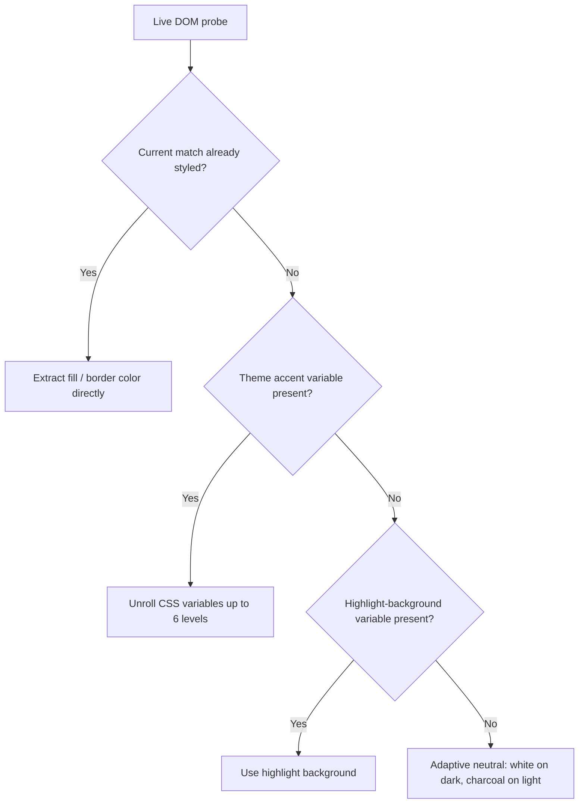

# Obsidian Incremental Search

[](https://github.com/notuntoward/obsidian-incremental-search/actions/workflows/build.yml)
[](https://github.com/notuntoward/obsidian-incremental-search/actions/workflows/codeql.yml)
[](https://github.com/notuntoward/obsidian-incremental-search/actions/workflows/scorecard.yml)

Incremental search for Obsidian notes and PDFs. Start typing and jump straight to the match — no need to open a separate panel or type a whole phrase.

Inspired by GNU Emacs `isearch` and `swiper`, for anyone who'd rather keep their hands on the keyboard.

## Contents

- [Quick start](#quick-start)
- [How search works](#how-search-works)
- [Commands & keyboard shortcuts](#commands--keyboard-shortcuts)
- [In-search controls](#in-search-controls)
- [Settings](#settings)
- [Customizing highlight colors](#customizing-highlight-colors)
- [Development](#development)
- [Developer notes: highlight color engine](#developer-notes-highlight-color-engine)

## Quick start

1. Run **Incremental Search: Forward** or **Incremental Search: Backward** from the Command Palette (assign a hotkey — see below).
2. Start typing. Matches highlight as you go, starting from your cursor.
3. Press the same hotkey again to jump to the next match, or press `Enter` to land the cursor there and close the search.

Works in notes (source and Live Preview), tables, callouts, and PDFs.

## How search works

Type a few words and the plugin finds them nearby, in order — you don't need the exact phrase.

For example, searching `the KAN` matches text like *"the original KAN"* — the words don't need to be adjacent.

**Need an exact match?** Wrap any part of your search in double quotes. Searching `"the KAN"` matches only that exact phrase, with no words in between.

You can mix quoted and unquoted parts in the same search. For example:

`foo "bar baz" qux`

Here, `foo` and `qux` are still flexible, but `bar baz` must appear together, exactly as written, in between.

To search for a literal quote character inside a quoted phrase, escape it with a backslash, as in `"she said \"hi\""`.

**Case sensitivity is automatic.** All-lowercase searches ignore case (`react` matches `React`); typing any capital letter makes the search case-sensitive (`React` matches only `React`).

**Extra spaces are literal.** One space between words is a flexible gap; two or more spaces require that many literal spaces in the note.

> [!TIP]
> In PDFs, matches must start at word boundaries and gaps between words are bounded. This still lets you type a prefix like `modalit` to match `modalities`, while avoiding false matches that start mid-word or span unrelated paragraphs.

## Commands & keyboard shortcuts

Hotkeys are unassigned by default so they never conflict with your existing keymap.

| Command | Command ID | Suggested hotkey | Description |
| :--- | :--- | :--- | :--- |
| Incremental Search: Forward | `obsidian-incremental-search:forward` | `Ctrl+S` / `Cmd+S` or `Alt+S` | Start or advance forward search from the cursor |
| Incremental Search: Backward | `obsidian-incremental-search:backward` | `Ctrl+R` / `Cmd+R` or `Alt+R` | Start or advance backward search from the cursor |

To assign hotkeys: **Settings → Hotkeys**, search for "Incremental Search," and bind both commands.

## In-search controls

Once a search is active, these keys control navigation and how the search session ends. Which behavior you get for `Enter`, `Shift+Enter`, and `Esc` depends on the **Search exit behavior** setting (**Settings → Incremental Search → Navigation & exit behavior**) — the two columns below show the two available modes.

| Key | Emacs-style mode (default) | Obsidian-style mode |
| :--- | :--- | :--- |
| Type characters | Updates query, jumps to nearest match | Updates query, jumps to nearest match |
| Forward hotkey / `F3` | Next match | Next match |
| Backward hotkey / `Shift+F3` | Previous match | Previous match |
| `Enter` | Accept match, place cursor, close search | Find next match |
| `Shift+Enter` | Accept match, place cursor, close search | Find previous match |
| `Esc` | Cancel, restore original position | Accept match, close search |
| `Ctrl+G` | Not bound by default | Not bound by default |
| `Ctrl+Enter` / `Cmd+Enter` | Toggle highlighting of other matches — only when "Highlight all matches" is set to *On demand* | Same as Emacs-style |
| Double-tap the search hotkey (once assigned) | Recall last query, continue searching | Recall last query, continue searching |
| Click outside / switch tab | Dismiss, keep current cursor position | Dismiss, keep current cursor position |

## Settings

All options live under **Settings → Incremental Search**.

**Navigation & exit behavior**
- *Search exit behavior* — Emacs-style (`Enter` accepts, `Esc` cancels) or Obsidian-style (`Enter` finds next, `Esc` accepts). This also determines the default bindings shown in the table above.

**Match highlighting**
- *Highlight all matches* — on demand (default; toggle with `Ctrl+Enter`/`Cmd+Enter`), always, or off. `Ctrl+Enter` only has an effect when this is set to *on demand*.
- *Secondary match highlight style* — adaptive theme-matched (default), dotted underline, subtle tint, Obsidian's default highlight, or custom colors.
- *Secondary match prominence* — slider, 20 to 100 percent (default 75).
- *Enforce text legibility (WCAG)* — keeps secondary-match contrast above the WCAG AA floor (4.5:1), falling back to a dotted underline if a color combination would fail (default on).
- *Custom colors* — light/dark theme color overrides, shown when "Custom colors" style is selected.
- A live preview swatch in the settings tab shows how highlights will look in your current theme.

**Matching rules**
- *Space-as-wildcard matching* — toggle wildcard gaps on spaces vs. plain substring search.
- *Match only visible part of links* — ignores hidden URLs and wikilink destinations when searching (default on).

**Interface**
- *Use popup modal interface* — swap the inline floating widget for a center-screen modal.

## Customizing highlight colors

Override highlight colors with a standard Obsidian CSS snippet:

```css
/* .obsidian/snippets/custom-incsearch.css */
:root {
  --incsearch-current-outline-resolved: var(--interactive-accent);
  --incsearch-secondary-fill: rgba(112, 93, 207, 0.15);
  --incsearch-secondary-edge: rgba(112, 93, 207, 0.45);
}

.theme-dark {
  --incsearch-secondary-fill: rgba(80, 160, 255, 0.18);
  --incsearch-secondary-edge: rgba(80, 160, 255, 0.5);
}
```

## Development

```bash
npm install

npm run test:run      # Vitest unit & integration suite (210+ tests)
npm run test:coverage
npm run test:browser  # Playwright browser integration tests

npm run lint          # ESLint, obsidianmd rules, zero-warning policy
npm run format        # Prettier
npm run build         # Type-check and bundle main.js
```

## License & acknowledgements

MIT License. Inspired by [GNU Emacs](https://www.gnu.org/software/emacs/) `isearch` and [Ivy / Swiper](https://github.com/abo-abo/swiper).

---

## Developer notes: highlight color engine

<details>
<summary>Expand for implementation details on adaptive match coloring (contributors / the curious)</summary>

> [!NOTE]
> This section uses LaTeX-style math notation. GitHub renders it via its math extension. In Obsidian, dollar signs are also used as MathJax delimiters — if anything here looks garbled in Obsidian's reader view, it's this delimiter conflict, not a content error. View this section on GitHub for the cleanest rendering.

The plugin avoids hardcoded highlight colors. Instead, it computes active- and secondary-match styling live from the current theme, aiming for consistent focal hierarchy and legibility across arbitrary light, dark, and custom themes.

### Active (current) match

- **Dual-ring boundary:** a 2px outline (`outline: 2px solid ...; outline-offset: 1px`) plus a complementary `box-shadow` halo, so the indicator stays visible over table borders, code blocks, and horizontal rules.
- **Non-destructive rendering:** `background-color: transparent !important` and `color: inherit !important` — the active match never paints over existing text color or Markdown formatting (bold, italic, syntax highlighting).
- **Adaptive outline contrast (`resolveOutlineColor`):** measures the theme's `--interactive-accent` (or `--color-accent`) contrast against the computed background; if contrast falls below a 3.0 to 1 ratio, it falls back to an inverted high-contrast color (white on dark backgrounds, black on light).
- **Context-aware behaviors:** table cells spawn a floating "Table Toast" with row/column context (for example, *Row 3, Col "Price": 45.00*); collapsed callouts auto-expand to show matches; PDF matches are handed to Obsidian's native PDF.js find controller for text-layer placement and scrolling.

### Secondary (non-current) matches

Secondary matches use a calibrated background tint plus an outset perimeter halo and baseline accent bar, rather than a plain highlight box:

- **Outset (not inset) halo:** inset borders clip glyph descenders (`g`, `j`, `p`, `q`, `y`); an outset `box-shadow` wraps the word from outside instead.
- **Baseline accent bar:** a thin `inset` bar under the text anchors it without a full 4-sided border.

**Why luminance-adaptive blending:** linear alpha blending of a fixed highlight color looks inconsistent across very light and very dark backgrounds, because human perception of color saturation itself changes with background luminance. This is the Hunt effect from color appearance modeling: perceived colorfulness is proportional to physical chroma scaled by a luminance adaptation factor, so a fixed-alpha tint that looks vivid on white paper looks muddy on an AMOLED-black theme, and vice versa.

Rather than binning themes into light and dark presets, the engine computes the background's exact relative luminance (a value from 0 to 1) and evaluates a continuous curve derived from the CAM16 color appearance model to get a luminance-adaptation factor. From that, it derives a continuous "darkness deficit" (also 0 to 1) that scales the fill and edge opacity as a function of both that deficit and the user's prominence setting (20 to 100 percent). Darker backgrounds get a larger deficit value, which increases both fill and edge opacity to compensate for reduced perceived colorfulness.

Sample points along this curve:

| Background | Example theme | Deficit | Fill opacity range | Edge opacity range |
| :--- | :--- | :---: | :---: | :---: |
| Pure white | Obsidian Light | 0.00 | 11% to 24% | 27% to 55% |
| Warm paper | Flexoki Warm Light | 0.05 | 12% to 26% | 28% to 58% |
| Mid-grey / slate | Solarized / Minimal | 0.52 | 18% to 36% | 40% to 74% |
| Nord slate | Nord Dark | 0.89 | 23% to 44% | 49% to 88% |
| Charcoal | Obsidian Dark | 0.96 | 24% to 45% | 51% to 91% |
| AMOLED black | Minimal OLED / True Black | 1.00 | 25% to 46% | 54% to 92% |

These are sample points on a continuous function, not discrete presets — any background luminance produces its own tailored blend. (The exact formulas are in `resolveOutlineColor` and the surrounding color-utility functions in the source, rather than reproduced here, to avoid the math-rendering conflicts noted above.)

**Saturation lift (`ensurePerceptibleAccent`):** on dark themes, channel values are scaled toward maximum emission and lifted proportional to the darkness deficit, turning muted dark hues (for example, a dark purple) into more perceptible pastels. On warm light themes, pale accent colors are saturated and deepened to guarantee at least a 2.8 to 1 contrast ratio against paper-toned backgrounds.

**Tokenized wildcard highlighting:** in wildcard mode (searching `the KAN`), only the matched keyword tokens are highlighted (`.incsearch-match-wildcard-word`); the flexible gaps between them are left unstyled (`.incsearch-match-wildcard-gap`) to avoid large, noisy blocks of background color.

**WCAG legibility fallback:** when "Enforce text legibility" is on, every computed color is checked against WCAG relative-luminance contrast math. If a fill would drop text contrast below a 4.5 to 1 ratio, the plugin suppresses the background fill and substitutes a dotted underline instead.

**PDF-specific handling:** PDF matches use PDF.js-native text-layer geometry, with the same adaptive fill and edge variables as Markdown. Adjacent PDF.js text fragments on the same visual line are joined to avoid seams in the outline. Page background is detected automatically — white canvas-rendered pages use light-theme calculations even under a dark Obsidian theme, while pages rendered with a CSS invert filter (for example, the Minimal theme's PDF dark mode) use dark-theme calculations — so highlight colors always contrast correctly against the actual rendered page.

**Accent color discovery:** the engine probes the live DOM in priority order: first, it tries to extract color directly from an already-styled current-match element if present; otherwise it unrolls theme CSS variables up to six levels deep (for example, an interactive-accent variable resolving through a named color variable down to an HSL value); otherwise it falls back to the theme's highlight-background variable if defined; and if none of those are available, it uses an adaptive neutral (white on dark themes, charcoal on light).



</details>
