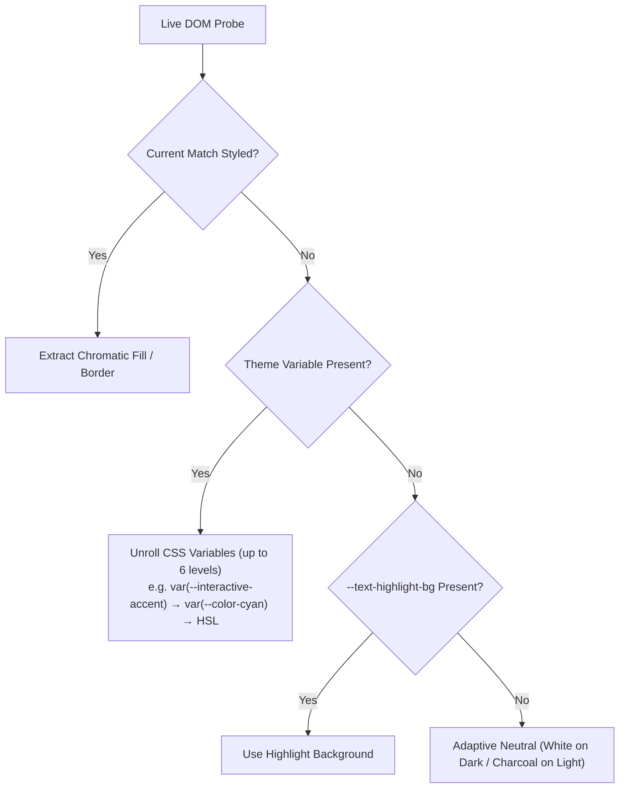

# Match Appearance Architecture & Visual Design

Technical reference for the plugin's highlight-color engine: contributors, maintainers, and anyone curious about the color math behind the adaptive theming. This document is the canonical source for these details — the README links here rather than duplicating this content.

This document uses LaTeX-style math notation (`$...$` and `$$...$$`), which GitHub renders natively via its math extension. If you're viewing this in Obsidian, be aware that Obsidian also uses dollar signs as MathJax delimiters — rendering should still work correctly here since this file is dedicated to math-heavy content, but if anything looks garbled, view it on GitHub for the cleanest result.

## Overview

The plugin avoids hardcoded or static highlight styles. Instead, it implements a visual appearance engine that balances **focal command**, **spatial density awareness**, and **perceptual consistency** across diverse themes, backgrounds, and document types.

```
┌────────────────────────────────────────────────────────────────────────┐
│ Visual Appearance Architecture                                        │
│                                                                        │
│  ┌───────────────────────────────┐   ┌───────────────────────────────┐ │
│  │     ACTIVE (CURRENT) MATCH    │   │      SECONDARY MATCHES        │ │
│  │ • 2px Outline + 1px Offset    │   │ • Hunt Effect CAM16 Tint (F_L)│ │
│  │ • Dual-Ring Box-Shadow Halo   │   │ • Outset 1px Framing Halo     │ │
│  │ • 100% Transparent Background │   │ • Inset 1.5–2px Baseline Bar  │ │
│  │ • Non-Destructive Text Colors │   │ • Tokenized Wildcard Words    │ │
│  │ • Table Toast Context Popup   │   │ • WCAG AA Legibility Fallback │ │
│  └───────────────────────────────┘   └───────────────────────────────┘ │
└────────────────────────────────────────────────────────────────────────┘
```

---

## 1. Active (Current) Match Design Method

The active match represents the user's **immediate navigational target**. Its visual treatment is designed to command instant focal attention without modifying or obscuring the underlying document formatting.

### A. Dual-Ring Boundary Enclosure

- **Outer Outline:** A 2px solid boundary offset by 1px (`outline: 2px solid ...; outline-offset: 1px`).
- **Outset Halo:** A complementary `box-shadow: 0 0 0 2px ...` halo wraps the match. This dual-ring structure ensures the active indicator remains crisp and visible even when positioned directly over table borders, code blocks, or horizontal rules.
- **Corner Curvature:** Rounded with `--radius-s` (4px) to blend naturally with Obsidian's modern UI controls while maintaining structural alignment in fixed-pitch code.

### B. Non-Destructive Formatting & Color Preservation

- **Transparent Fill (`background-color: transparent !important`):** Unlike standard search tools that draw opaque yellow or blue boxes over active text, the active match uses zero background fill.
- **Text Color Inheritance (`color: inherit !important`):** Font colors, Markdown formatting (bold, italics), and syntax-highlighted code tokens remain completely unaltered.

### C. Adaptive Contrast Guarantee (`resolveOutlineColor`)

The engine measures the computed background luminance of the active viewport against the theme's `--interactive-accent` or `--color-accent`. If the theme's accent color lacks sufficient contrast ($< 3.0:1$), the algorithm dynamically pivots to an inverted high-contrast safeguard (`#ffffff` on dark, `#000000` on light).

### D. Context-Aware Specialized Behaviors

- **Markdown Tables:** Highlights the targeted cell and spawns a floating **Table Toast** displaying parent row and column headers (e.g. `[Row 3, Col "Price"]: $45.00`).
- **Callouts:** Searches collapsed callouts and triggers auto-expansion with highlighted inline spans (`.incsearch-callout-match.is-current`).
- **PDF Documents:** Supplies wildcard match ranges to Obsidian's PDF.js find controller, which owns text-layer placement, current-match selection, scrolling, and forward/backward navigation.

---

## 2. Secondary (Non-Current) Match Design Method

Secondary matches serve as **spatial waypoints** — they provide density and distribution awareness across the viewport without competing for focal priority with the active match.

### A. Visual Subordination & Dual-Layer Framing

Secondary matches combine a calibrated background tint with an **outset perimeter halo** and **baseline accent bar**:

- **Outset 1px Halo (`box-shadow: 0 0 0 1px ...`):** Standard `inset` borders render inside the glyph bounding box, causing letter descenders (`g`, `j`, `p`, `q`, `y`) to paint over and mask the highlight border. Outset framing wraps the word from the outside, eliminating glyph collision.
- **Baseline Accent Bar (`inset 0 -1.5px 0 ...` / `inset 0 -2px 0 ...`):** Anchors the text horizontally without the visual weight of a heavy 4-sided border.

### B. The Hunt Effect & CAM16 Luminance-Level Adaptation ($F_L$)

A fundamental challenge in UI color mixing is that linear opacity blending fails across varying background luminances. Under the **Hunt effect**, human perception of colorfulness (saturation) collapses in low-luminance environments:

$$\text{Perceived Colorfulness } M = C \cdot F_L^{0.25}$$

- **On Pure White / Warm Paper ($Y_{\text{bg}} \approx 0.90\text{--}1.00$):** High luminance ($F_L \approx 1.0$) means a subtle $10\%\text{--}24\%$ tint is perceived with high vividness.
- **On AMOLED Black / Charcoal ($Y_{\text{bg}} \le 0.03$):** Low luminance ($F_L^{0.25} \approx 0.735$) causes the same physical mix to appear dull and dark grey. High-brightness text glyphs ($L \approx 0.7\text{--}1.0$) induce local brightness suppression over dark highlights.

This matters practically because a fixed-alpha tint that looks vivid on white paper looks muddy on an AMOLED-black theme, and vice versa — a single hardcoded highlight color cannot look correct across the full range of themes Obsidian supports.

#### Fully Continuous Adaptation (No Discrete Modes or Tiered Thresholds)

Rather than binning themes into discrete categories or fixed lookup presets, the engine measures the live computed background color down to its exact floating-point relative luminance $Y_{\text{bg}} \in [0.00, 1.00]$ and evaluates a **strictly continuous mathematical curve**:

$$L_A = 5 + 195 \cdot Y_{\text{bg}} \quad (\text{adapting luminance in cd/m}^2)$$
$$k = \frac{1}{5 L_A + 1}$$
$$F_L = 0.2 k^4 (5 L_A) + 0.1 (1 - k^4)^2 (5 L_A)^{1/3}$$

The continuous darkness deficit $D = \frac{1.0 - F_L^{0.25}}{0.265} \in [0.0, 1.0]$ scales the mixing alphas along smooth, uninterrupted transfer functions:

$$\alpha_{\text{fill}}(P, D) = (0.08 + 0.12 \cdot D) + (0.16 + 0.10 \cdot D) \cdot P$$
$$\alpha_{\text{edge}}(P, D) = (0.20 + 0.25 \cdot D) + (0.35 + 0.12 \cdot D) \cdot P$$

Here, $P \in [0.20, 1.00]$ is the user's **Secondary match prominence** setting (20%–100%), and $D$ is the darkness deficit computed above. Darker backgrounds produce a larger $D$, which increases both fill and edge alpha to compensate for the Hunt effect's reduction in perceived colorfulness.

> [!NOTE]
> The values below are **illustrative sample benchmarks along the continuous function**, not hardcoded presets. Any arbitrary background color automatically computes its own tailored blend:

| Sample Background ($Y_{\text{bg}}$) | Example Theme | Computed Deficit ($D$) | Continuous Fill Alpha ($20\%\text{--}100\%$ Prominence) | Continuous Edge Alpha ($20\%\text{--}100\%$ Prominence) |
| :--- | :--- | :---: | :---: | :---: |
| **Pure White** ($Y = 1.00$) | Obsidian Light | `0.00` | `0.11` → `0.24` | `0.27` → `0.55` |
| **Warm Paper** ($Y = 0.93$) | Flexoki Warm Light | `0.05` | `0.12` → `0.26` | `0.28` → `0.58` |
| **Mid-Grey / Slate** ($Y = 0.20$) | Solarized / Minimal | `0.52` | `0.18` → `0.36` | `0.40` → `0.74` |
| **Nord Slate** ($Y = 0.035$) | Nord Dark | `0.89` | `0.23` → `0.44` | `0.49` → `0.88` |
| **Charcoal** ($Y = 0.013$) | Obsidian Dark | `0.96` | `0.24` → `0.45` | `0.51` → `0.91` |
| **AMOLED Black** ($Y = 0.00$) | Minimal OLED / True Black | `1.00` | `0.25` → `0.46` | `0.54` → `0.92` |

The exact formulas above live in `resolveOutlineColor` and the surrounding color-utility functions in the source (`src/widget.ts` and/or related styling modules — confirm exact file/function names against the current codebase, as this document may lag behind refactors).

### C. Luminous Lifting & Saturation Deepening (`ensurePerceptibleAccent`)

- **Dark Themes:** Channel values are scaled to maximum emission (`255`) and lower channels receive a luminous lift proportional to $D$, transforming dark saturated hues (e.g. deep purple `#705dcf`) into glowing, radiant pastels.
- **Warm Light Themes:** Pale pastel highlights (e.g. soft yellow on warm cream `#FFFCF0` / `#F2F0E5`) are automatically saturated and deepened to guarantee $\ge 2.8:1$ contrast against paper backgrounds.

### D. Tokenized Space-as-Wildcard Highlighting

In wildcard mode (`the KAN`), secondary matches highlight **only the matched keyword tokens** (`.incsearch-match-wildcard-word`). Wildcard gaps are left unhighlighted (`.incsearch-match-wildcard-gap`), eliminating large noisy blocks of background color.

### E. Text Legibility Protection (WCAG AA 4.5:1)

When **Enforce text legibility** is enabled, every composite color is verified against WCAG relative luminance equations. If a candidate background tint would reduce text contrast below **4.5:1**, the background fill is automatically suppressed (`background: transparent`) and replaced with a non-intrusive dotted underline (`text-decoration: underline dotted`).

### F. Native PDF Highlight Styling

PDF matches retain PDF.js-native text-layer geometry. The plugin styles native secondary matches with the same adaptive fill and edge variables used in Markdown, while the selected match uses the transparent current-match outline. Adjacent PDF.js fragments on the same visual line are joined to avoid internal outline seams.

PDF page appearance is detected automatically: white canvas-rendered pages use light-theme color calculations even inside a dark Obsidian theme, while pages rendered with CSS `filter: invert(...)` (e.g. Minimal's PDF dark mode) use dark-theme calculations. This ensures match colors always contrast correctly against the actual PDF page.

---

## 3. Defensive Accent Discovery & Variable Unrolling

The engine inspects the live DOM through a prioritized fallback hierarchy, since a theme may or may not expose a usable accent color through any single, predictable CSS variable:



In priority order:

1. If the current match already has computed styling in the live DOM, extract its fill/border color directly.
2. Otherwise, unroll theme CSS variables up to 6 levels deep (e.g., `--interactive-accent` may resolve through `--color-cyan` down to a final HSL value) to find a usable accent.
3. Otherwise, fall back to the theme's `--text-highlight-bg` variable if defined.
4. Otherwise, use an adaptive neutral: white on dark themes, charcoal on light themes.

This fallback chain exists because Obsidian themes vary widely in which CSS custom properties they define and how deeply those properties are aliased to one another; a naive single-variable lookup would leave many third-party themes without a usable accent color at all.

---

## Related

- User-facing settings that control the options referenced above (prominence slider, legibility enforcement, highlight style) are documented in the main [README](README.md#settings).
- CSS custom properties for manual overrides are documented in the main [README](README.md#customizing-highlight-colors).
